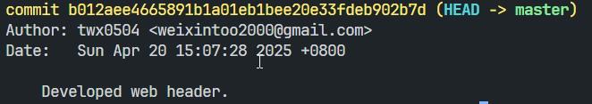
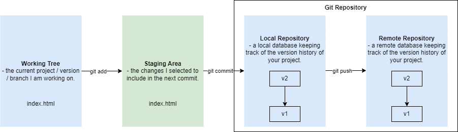
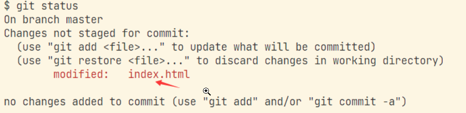
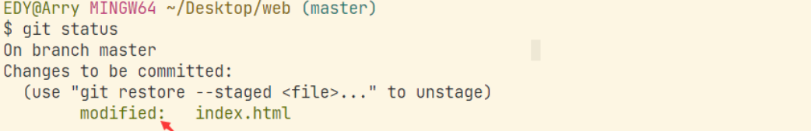
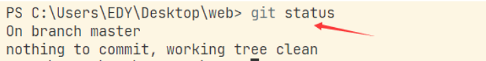
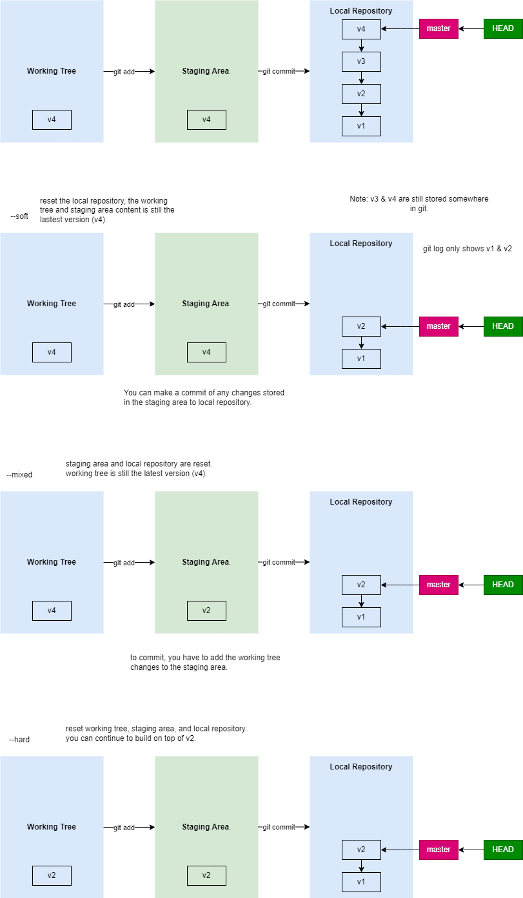

# Git Basic

## 01 What is Git?

> - a distributed version control system.
> - developed by Linus Torvalds (The father of Linux).

## 02 What is Version Control?

- a system for tracking changes to files over time.

```js

/* Manual Version Control: */
// 10-4: event planner v1.doc
// 11-4: event planner v2.doc
// 13-4: event planner modified.doc
// 15-4: event planner final-draft.doc
// 16-4: event planner finalized.doc

/* 
    What if your boss wanted you to make some changes based on one of these previous version?
    - You might forget if you didn't put a nice name to it...
    - You might regret it if you deleted the file earlier this morning and it can never bring back.
*/

```

## 03 History of Version Control System

> - manual version control (copy + change name)
> - local version control
> - centralized version control
> - distributed version control

### 3.1 Manual Version Control

> - simple (copy files into another directory)
> - error-prone (forgetting directory/ writing to wrong files / overriding existing files, etc)

### 3.2 Local Version Control

> - use a simple local database to keep track of all changes.
> - store only changes as patches
> - roll back to earlier version by applying those patches.
> - e.g., Revision Control System (RCS)
> - downsides:
> > - only works for local machine, no collaboration.

### 3.3 Centralized Version Control

> - store version history in a centralized server.
> - all developers retrieve the latest version from this server.
> - allow collaboration.
> - downside:
> > - when the server goes down, collaboration becomes impossible.
> > - risk of data loss if the server's storage fails and no backup exist.


### 3.4 Distributed Version Control

> - download / clone the entire repository, including the full version history.
> - any client repository can serve as a backup to restore the server if it ever dies.
> - e.g., git


## 04 Git Setup 

### 4.1 Set Up Your Identity



> - every git commit will bake your identity into the commit.
> - who commits the code, and what is his contact info?
> - when the commited code has issues, other developers can quickly contact the person who made the commit.

**Set global identity:**

> - Git always uses the information for the user on that system.
> - There's a `.gitconfig` file in the user's home directory.
```js
/* Setting global identity */
// git config --global user.name 'twx0504'
// git config --global user.email weixintoo2000@gmail.com 
```

**Set local identity**

> - Git will uses the local identity for the current project.
> - it will write the identity to the .git/config file.

```js
/* Without --global option */
// git config user.name "twx0504"
// git config user.email "weixintoo2000@gmail.com"
```

### 4.2 Git Init

> - Not every project requires git.
> - tell git to start managing the current project.
> - it creates a hidden .git subdirectory in the root of the project.
> > - contains all the necessary metadata and version history for the repository.
```js
// git init # Initialize a local Git repository
```

## 05 Creating New Version

>  Tip: create different versions of your project based on features or functions that you're developing.

### 5.1 The Three States 



```js
// working tree -> staging area -> git (local) repository -> remote repository

```

> **Git Workflow: **
> - working tree: 
>   - the current project you are working on.
>   - represents one of many version / branches I've created, and I can switch between them when needed.
> - staging area:
>   - an area that stores the changes you selected to go into the next commit.
> - git repository: 
>   - the database that keep track of the version history of your project.
>   - local & remote.

### 5.2 File Statuses

> Note: check status using `git status`.

> - modified: changes has been made but not yet staged.



> - staged: changes are staged to be included in the next commit, but not yet commited.



> - commited: changes are committed / saved to the git repository.




### 5.3 Commands

1. `git add <filename>` / `git add .`: add file / files to the staging area.
2. `git commit` / `git commit -m <message>`: commit changes and saved to the git repository.
3. `git status`: check file statuses of the current project.
4. `git log` / `git log --oneline`: check committed version history.


## 06 Git Undo Operations

### 6.1 Undo Last Commit

> use cases:
> - change the commit message.
> - add forgotten files.

`git commit --amend` / `git commit --amend -m <message>`

> - it creates a new commit, and replace the previous commit.
>   - using `git log`, you cannot find the previous commit.
>   - using `git reflog`, you can see the previous commit that has been replaced.

> Note: whenever you made a commit, the commit will never be truly deleted.


### 6.2 Undo Staged Files


> - accidentally staged two different features or tasks in one commit

> - `git restore --staged <filename>`

### 6.3 Undo File Modification

> - when accidentally modify a file that you haven't backed up and you wish to restore to the state before modifying.

> - `git restore <filename>` / `git restore .`

> - the file must be committed at least once.

### 6.3 Git Reset



> - `git reset --soft <version>`: only reset the git repository.
> - `git reset --mixed <version>` / `git reset <version>`: only reset the staging area and git repository.
> - `git reset --hard <version>`: reset working tree, staging area and git repository.
> - note: `<version>` refers to the commit hash (SHA-1).

> Note:
>
> - when reset, the previous versions are still stored somewhere.
> - use `git reflog` to check the whole version history.

## 07 Git Configuration File

> Note: The priority of the identity: local > global > system.

> - system: `C:\Program Files\Git\etc`
> > - requires permission (administratro)
> > - e.g., mimicking collaboration of multiple developers.
```js
// Note: open git bash / power shell as administrator
// git config --system user.name <username>
// git config --system user.email <email>

```

> - global: `C:\Users\twx0504`
> > - usually, global is what we need.
```js
// git config --global user.name <username>
// git config --global user.email <email>

```

> - local: 
> > - if a specific project requires different identity, you can use local identity to override the global one.
```js
// git config user.name <username>
// git config user.email <email>

```

## 08 .gitignore

> - a file (.gitignore) that tells Git to not track certain files / directories.

### 8.1 Format

> - writing comment
```
# comment

```
> - glob pattern (search recursively - go deeper into subdirectories.)
> > 1. `*`: match  zero or more of any characters.
> > 2. `[abc]`: match any one character listed inside the brackets.
> > > - `-`: represents range 
> > > - e.g., `[0-9]` means matching any digit from 0 to 9.
> > 3. `?`: match exactly a single character
> > 4. `**`: match any number of intermediate directories.
> >     - e.g., `a/**/d` means `a/d`, `a/b/d`, `a/b/c/d`, etc.

> `/` at the start: prevent recursion (only the file in the current directory)

```
/demo.txt # only the demo.txt on the current directory.
```

> `/` at the end: specify the directory (ignore all files under a specific directory)

```
node_modules/
```

> `!`: negate the ignore rule

```
# Ignore all files starting with test.
test.*

# Do not ignore test.html
!test.html
```