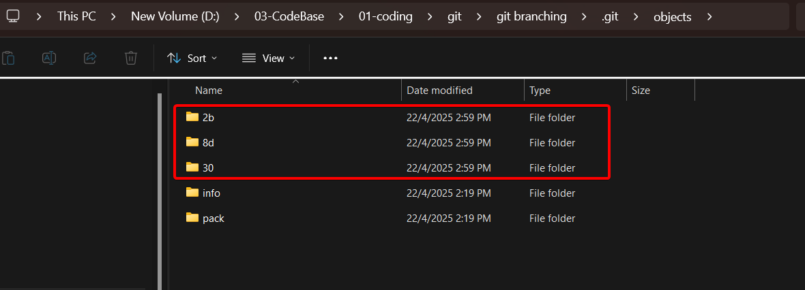
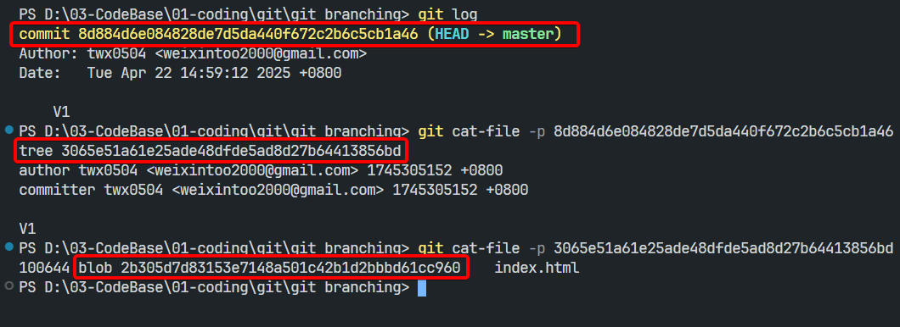
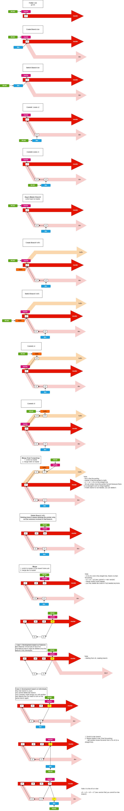

# Git Branching

## 00 What is a snapshot?
> stackoverflow: https://stackoverflow.com/questions/4964099/what-is-a-git-snapshot
> - each commit has three file in .git/object




## 01 Understanding Git Branching

> - Git branching allows you to create separate lines of development.
> - These branches are branching out of the main / master branch, allowing you to work on different things: new features, tests, bugfix, experiments etc.
> - `master` / `main` is also a branch, created during git init.
> - branching allows collaboration among developers, each person in charge of a branch working on a specific features.
> - once developed, these features can be merged with master branch.




> Note:
> - You cannot create a branch until there's at least one commit in the repository. (the first commit must be on the master branch.)
> - switching branch means moving HEAD pointer to that branch you switched to.
> - deleting branch means deleting the branch pointer.
> - fast-forwarding merging happens when there's no divergent commits.
> > - the current branch pointer moves forwards to the branch you want to merge with.
> - When there's divergent commits (not a straight line), then you probably have to deal with merge conflict and then make a new commit.
> - merge conflict happens when both branches modify the same part of a file, and Git doesn't which version to keep.


> **Cases:**
> - branch based on feature
>   - Once merged, the feature branch can be deleted.
>   - The next feature will be developed by creating a new branch based on the updated master (or main).
> - branch based on individual
>   - Once changes are merged into master, you keep using the same personal branch for the next feature.
>   - Before starting a new task, you should sync your branch with the latest master:


### 1.1 Create Branch

```bash
# Create a branch
# git branch <branch-name>
git branch dev
```

### 1.2 Check Branches

```bash
# Checking branches
git branch
# or
git branch -v # show more details

```

### 1.3 Switch Branches

```bash
# Switching branch
# git checkout <branch-name>
# or
# git switch <branch-name>  

git checkout dev # good compatibility
git switch dev # >= v2.23.0 
```


### 1.4 Delete Branch

> - you cannot delete the branch you're currently on. You can only delete other branches from your current branch.
> - Deleting a branch means removing its pointer to a specific commit.
> - The commits are not deleted!

```bash
# Deleting branch
# git branch -d <branch-name>
git branch -d hotfix
```


### 1.5 Merge Branch

> - Always merge into the branch you're currently on.
> - merge conflict may happens if there's overlapping changes.
> - after resolving the conflict, you need to make a new commit to complete the merge.

```bash
# Switch to the branch you want to merge INTO
git switch master  # switch to the master branch

# Merge the other branch into the current branch
git merge dev      # merge dev into master
```

### 1.6 Git Log

```bash
git log
git log --oneline
git log --oneline --graph # You can view your branch
git log --all --graph # You can view your branch
git reflog # 
```